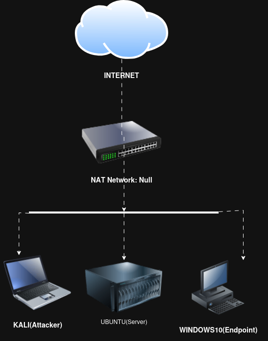

# Architecture Diagram

## Overview

The diagram below illustrates the high-level architecture of the homelab environment.
It shows how all virtual machines are hosted within Oracle VirtualBox and connected through a shared NAT Network.

This visual representation is intended to complement the written architecture overview by providing a clear and immediate understanding of system roles and network relationships.

## Logical Architecture Diagram

## Diagram Explanation

- The **Host Machine** runs Oracle VirtualBox, which hosts all virtual machines.
- All virtual machines are connected to a single **NAT Network** named `Null`.
- **Kali Linux** represents an attacker or security testing system.
- **Ubuntu Linux** represents an internal server hosting services.
- **Windows 10 Enterprise** represents a corporate endpoint.
- Internet access is provided through the NAT Network while maintaining isolation from the host network.

This design allows safe experimentation with offensive and defensive security techniques while preserving a clear separation of roles.
