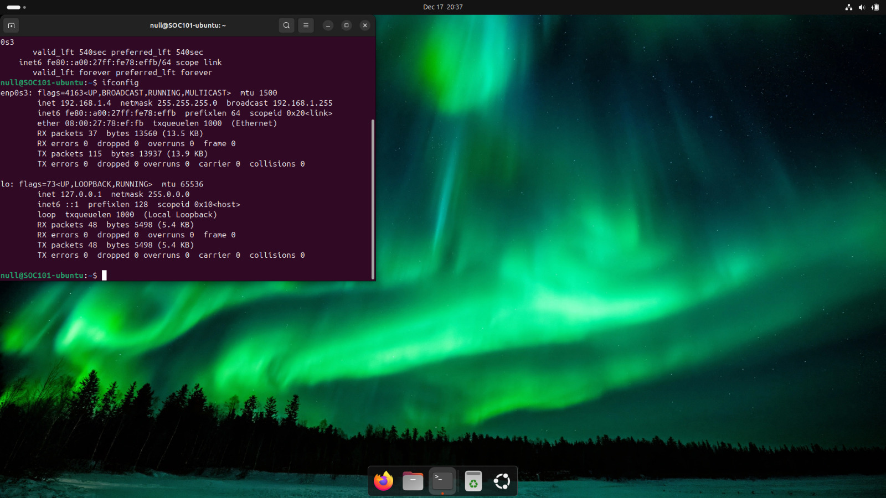

# Ubuntu Linux Setup

## Purpose

Ubuntu is used as a **server system** in the lab to host services that can be tested by the attacking Kali VM, i also use ubuntu as an attacking an testing environment in place of kali.

## Installation Summary

1. In VirtualBox, create a new VM named `Ubuntu-Lab`.
2. Allocate appropriate resources (2–4 GB RAM, 20+ GB disk).
3. Attach the Ubuntu ISO.
4. Boot and follow the Ubuntu installer:
   - Disk configuration
   - User creation
   - SSH server selection (optional but recommended)
5. Complete installation and reboot into Ubuntu.

## Services Installed

Ubuntu is configured to support:
- SSH service (for remote testing):
  ```bash
  sudo systemctl status ssh

## Installation Evidence


