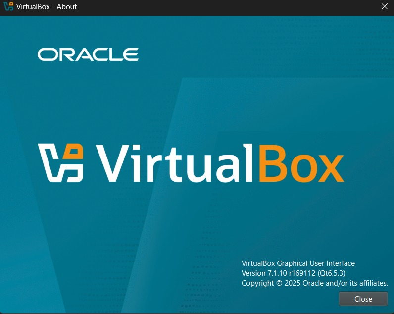

# VirtualBox Installation

## Objective
Install Oracle VirtualBox on the host machine to provide the virtualization platform for all lab virtual machines.

## VirtualBox Version
- Version installed: **7.1.10r169112**

## Installation Steps

1. Download VirtualBox from the official website (virtualbox.org).
2. Run the installer and follow the standard installation wizard.
3. Accept default options unless specific customizations are needed.
4. After installation, install the **VirtualBox Extension Pack** matching the exact version.
   - This enables enhanced features including USB support and improved networking.

## Verification

After installation, verify the version using the following command:

```bash
VBoxManage --version

## Installation Evidence



